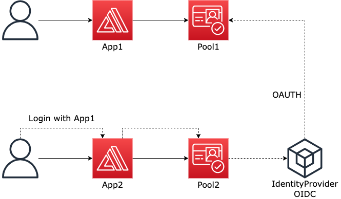
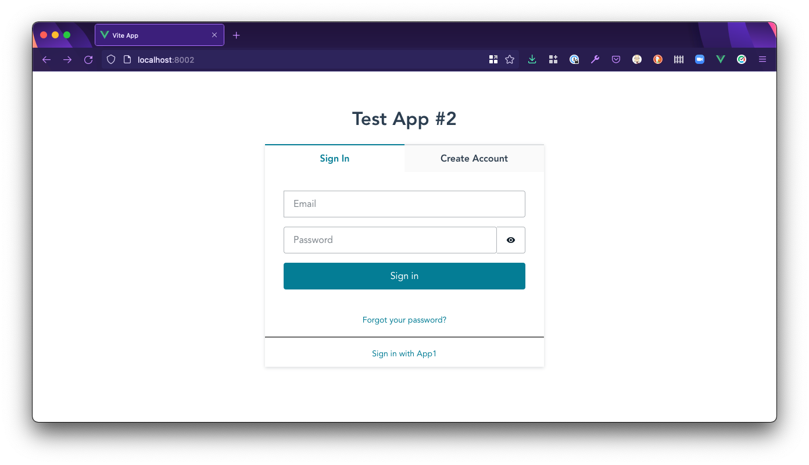
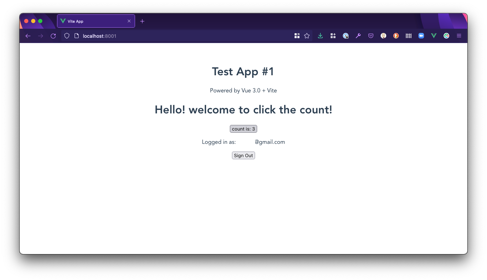
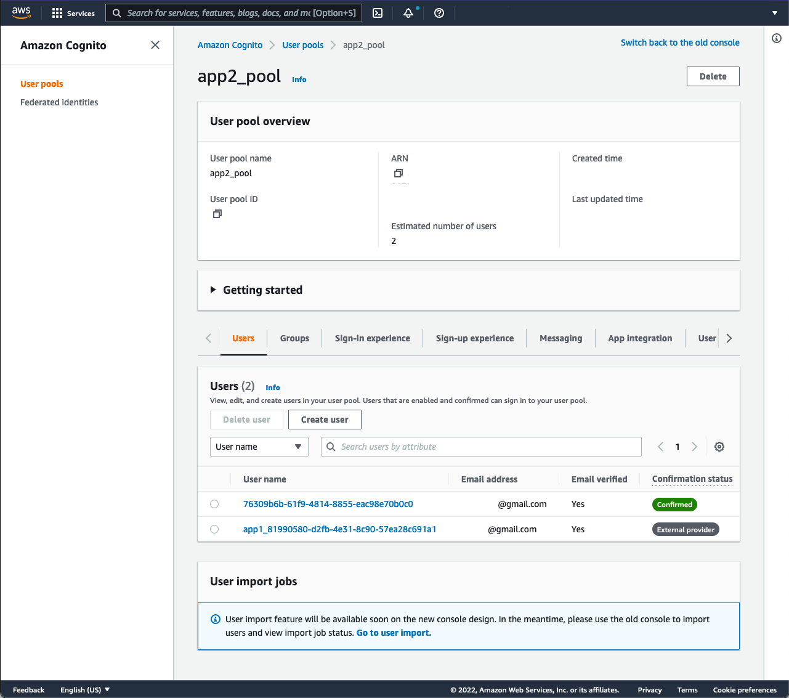
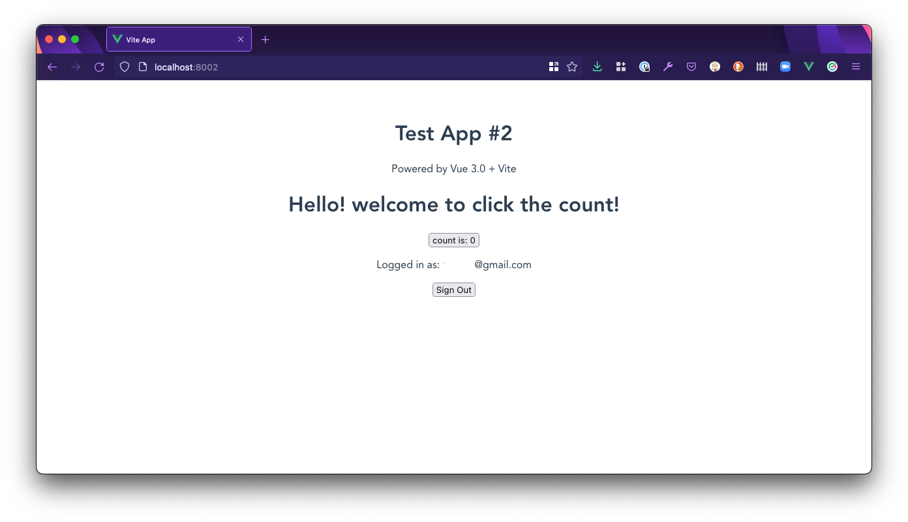
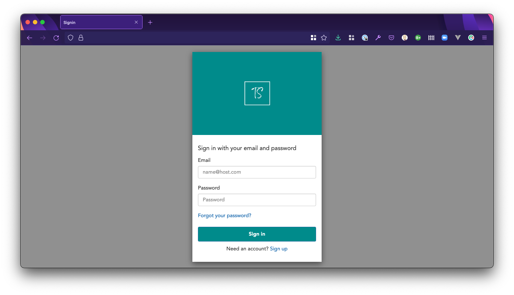

# Example Amazon Cognito to Amazon Cognito Federated Authentication

## How it works

Following is a high level architecture diagram of this solution.



- App1 uses Amazon Cognito Pool1 to login


- App2 uses Amazon Cognito Pool2 to login
- App2 has an option to login using App1
  - When App2 login using App1, it is configured to take you to Cognito Hosted UI of App1 to login
  - Upon successful login, it will redirect back to App2



### Validation

- Signed up a user using Cognito Pool1 in App1 and able to login to App1





- Signed up a user using Cognito Pool2 in App2 and able to login to App2
- Login to App2 with Sign in with App1 option






## Terraform

Everything you need to set it up in AWS are in the `terraform` directory.

`terraform apply` would create two Amazon Cognito pools with app clients and OIDC provider on Cognito Pool2.

Terraform outputs contains neccessary details for the Web Apps. Run `terraform output` to see the output.

```sh
Outputs:

app1 = {
  "app1_client1_id" = "123abc"
  "user_pool_id" = "eu-west-1_123456"
}
app2 = {
  "app2_client1_id" = "abc123"
  "app2_provider_id" = "eu-west-1_234567:app1"
  "app2_oauth_domain" = "xxxxx.auth.us-east-1.amazoncognito.com"
  "user_pool_id" = "eu-west-1_234567"
}
```

As of creation:

```
$ tfsec .

  times
  ------------------------------------------
  disk i/o             1.524124ms
  parsing HCL          11.626µs
  evaluating values    918.416µs
  running checks       5.421542ms

  counts
  ------------------------------------------
  files loaded         4
  blocks               19
  modules              0

  results
  ------------------------------------------
  critical             0
  high                 0
  medium               0
  low                  0
  ignored              0

No problems detected!
```

## Web Apps

Two webs are created for demonstration purposes only. They are in the `webapps` directory. You need to configure the Cognito details in the `webapps/app1/src/main.js` and `webapps/app2/src/main.js` for it to work.

Running this will just launch the app. Ports are configured statically. App1 uses TCP port 8001 and App2 uses TCP port 8002.

```sh
yarn
yarn dev
```
